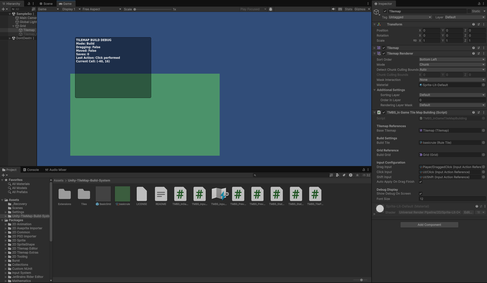
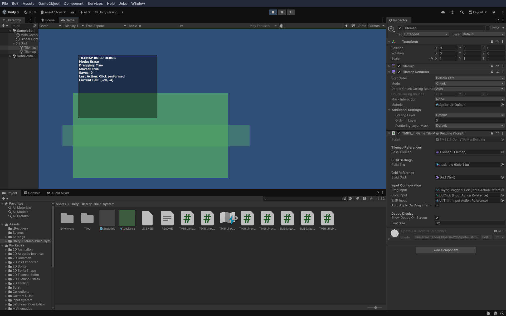
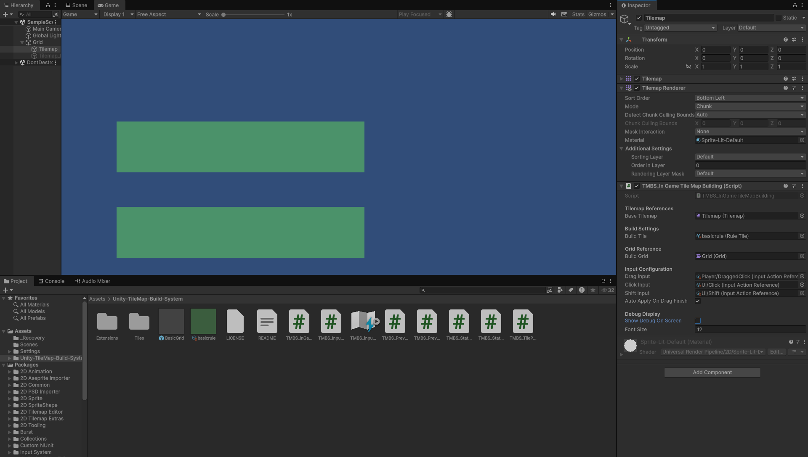

# Unity-TileMap-Build-System
Personal project, its a basic system that allow the player build with tiles on a tilemap using just clicks.

Main features:
- Preview of selected tiles.
- Multiselection tiles.
- Mouse based input.

Under development.

Preview:

